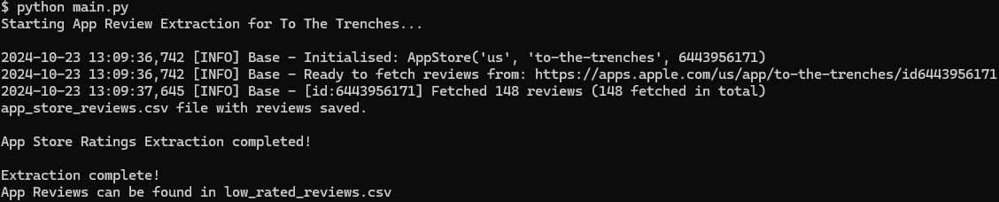

# Low Rated Reviews Extraction

This project allows you to scrape app reviews for [**To The Trenches**](https://apps.apple.com/us/app/to-the-trenches/id6443956171) from the AppStore and filter the reviews based on specific criteria. It uses the `app_store_scraper` library to scrape the reviews, then processes the data to extract only reviews with a low rating (*3 or less*), and saves them to a CSV file.

## Features

- Scrape all reviews from the AppStore page for **To the Trenches**.
- Extract the **Date**, **Rating**, and **Review** text from each review.
- **Filter** and **sort** reviews with ratings of **1**, **2**, or **3**.
- Output the low rated reviews data into a file named `low_rated_reviews.csv`.

## Requirements

### Python Packages

- `app_store_scraper`
- `numpy`
- `pandas`

You can easily install the necessary packages using:

```bash
pip3 install -r requirements.txt
```

## How to Use

### Running the Script

```bash
python3 main.py
```
This script will create the `low_rated_reviews.csv` and `app_store_reviews.csv` files in the project directory.<br>

**_NOTE: The `app_store_reviews.csv` file is created and stored for the purpose of extracting from the overall pool of reviews. You can delete this file after the script has ran._**



### Upload the Scraped file to Sheets

Now that we have our CSV file, we need to upload it to Google Sheets. From there we are able to analyze the extracted data in a well-formatted table.

